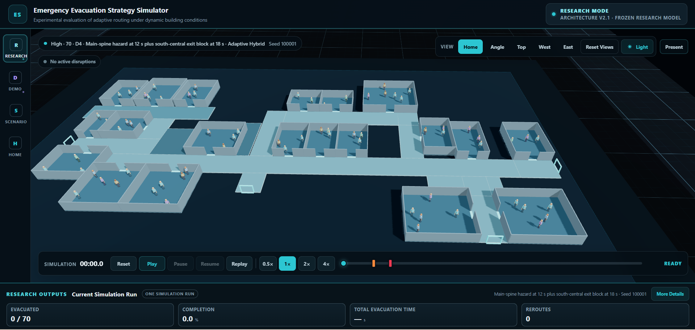

# 3D Emergency Evacuation Strategy Simulator

A simulation and research platform for comparing evacuation-routing strategies under changing congestion, hazards, and route availability.

The quantitative engine runs independently from the 3D interface. Formal experiments are executed headlessly from fixed parameters and recorded seeds; the browser application is used to inspect scenarios, replay runs, trace routes, and demonstrate the model.

**Live application:**
https://evacuation-strategy-simulator.nirman-bhowmike.workers.dev



## Research question

How do fixed and adaptive evacuation-routing strategies differ when congestion, hazards, blocked exits, blocked corridors, and occupancy change during an evacuation?

The study compares five routing policies inside the same fictional building model:

| Strategy | Routing basis |
|---|---|
| Nearest Exit | geometric nearest-exit baseline |
| Static Shortest Path | shortest feasible network path |
| Congestion-Aware | current congestion, queueing, and estimated travel time |
| Hazard-Aware | safety-first routing around active risk where possible |
| Adaptive Hybrid | safety, congestion, route feasibility, travel time, and rerouting inertia |

Adaptive Hybrid uses a frozen voluntary rerouting threshold of `0.10`.

## Formal experiment

The current formal study is complete.

| Item | Value |
|---|---:|
| Routing strategies | 5 |
| Occupancy levels | 3 |
| Disruption conditions | 7 |
| Paired seeds per cell | 40 |
| Factorial cells | 105 |
| Common-random-number scenario pairs | 840 |
| Formal simulation runs | 4,200 |
| Completed | 4,200 |
| Timeout | 0 |
| Unreachable present | 0 |

Formal execution provenance:

```text
Software version:  1.2.0
Git commit:        1a84923664c028f3b6b15c5ec93ddaf9b7905095
Design:            architecture-v2-formal-factorial-v3
Parameter set:     architecture-v2-research-v1.2-frozen
Seed bank:         architecture-v2-formal-seed-bank-v1
```

The execution commit is intentionally frozen. Later commits add analysis artifacts, deployment configuration, interface safeguards, and responsive presentation changes without changing the dataset used for the reported results.

Curated results are under [`results/formal-v1.2/`](results/formal-v1.2/).

## Experimental conditions

Formal occupancy:

```text
LOW     14 occupants
MEDIUM  42 occupants
HIGH    70 occupants
```

Formal disruptions:

| ID | Condition |
|---|---|
| D0 | Baseline |
| D1 | Main-spine hazard at 12 s |
| D2 | South-central exit block at 18 s |
| D3 | Main-central corridor block at 12 s |
| D4 | Main-spine hazard at 12 s + south-central exit block at 18 s |
| D5 | West exit block at 18 s |
| D6 | East-main to southeast corridor block at 12 s |

A hazard is traversable and contributes to simulated exposure time. Exit and corridor blocks are hard availability constraints for new routing and entry after activation. An occupant already traversing an affected segment at the activation instant may complete that traversal under the frozen model semantics.

Strategies receive current state only. Future disruptions are not exposed before they occur.

## Main result

Adaptive Hybrid did not emerge as a universally fastest strategy. Its strongest behavior appeared where speed and simulated hazard exposure were in conflict.

Across the 84 Adaptive-versus-comparator scenario comparisons:

| Outcome | Significant Adaptive advantage | Significant Adaptive disadvantage |
|---|---:|---:|
| Evacuation time | 4 | 18 |
| Simulated hazard exposure | 20 | 0 |

There were 18 clear speed-exposure tradeoffs. In those cases, Nearest Exit, Static Shortest Path, or Congestion-Aware evacuated faster while Adaptive Hybrid produced lower simulated hazard exposure. These tradeoffs occurred systematically in D1 and D4 across LOW, MEDIUM, and HIGH occupancy.

The result is better read as multi-objective behavior than as a ranking of one strategy as globally superior.

The inferential analysis used paired common-seed comparisons, two-sided paired t-tests, Cohen's `dz`, exact sign tests as a sensitivity check, and Holm family-wise correction across 168 co-primary tests. The analysis plan was finalized after execution, so it is reported as post-execution multiplicity-controlled analysis rather than preregistered confirmatory testing.

## Model structure

The software separates three concerns.

**Simulation engine**

- deterministic fixed-step execution
- stochastic occupant generation from recorded seeds
- continuous movement along a navigation network
- density-sensitive walking speed
- bottleneck service constraints
- hazards and physical route closures
- routing and rerouting decisions
- evacuation and exposure metrics

**Experiment layer**

- formal factorial design
- common random numbers
- repeatable run identifiers
- batch execution
- JSON and CSV output
- manifests and Git provenance
- regression validation

**Visualization**

- 3D building replay
- occupants and route traces
- hazard and closure indicators
- playback controls
- scenario configuration
- selected-agent inspection
- Research and Interactive Demo modes

The renderer consumes simulation output. It does not run a separate evacuation model.

## Research Mode and Demo Mode

Research Mode uses the frozen D0-D6 design and recorded research parameters.

Interactive Demo Mode allows manual hazards, exit blocks, corridor blocks, and combinations for classroom or software demonstrations. Demo events are reproducible from the same seed and event log, but they are not formal experimental conditions and are not included in the 4,200-run analysis.

The two modes are deliberately separated in the interface.

## Browser interface

Desktop and laptop browsers provide the full interface, including camera presets, Present mode, detailed agent inspection, playback, scenario controls, and research metrics.

A responsive mobile layout is also available. Phone landscape is the stronger mobile viewing mode because it leaves more area for the 3D scene and supports the detailed Agent Inspector. Portrait mode keeps agent selection and route tracing but suppresses the full inspector so it does not cover the simulation.

Present mode is not exposed on phone layouts.

One known presentation limitation remains: extreme manual zoom-out on a narrow portrait viewport can reveal a large portion of the scene background. This is a visualization issue only and does not affect simulation state or numerical output.

If WebGL cannot be initialized, the application shows a visible fallback instead of failing to a blank screen.

## Validation

Current automated checkpoint:

```text
Test files:        66 passed
Tests:             455 passed
Failed tests:      0
TypeScript:        passed
Production build:  passed
```

The suite covers deterministic replay, route calculation, all five routing policies, density and bottleneck behavior, dynamic disruptions, formal experiment construction, provenance, timestep behavior, D5/D6 regression, visual/headless consistency, population generation, output generation, and Interactive Demo reproducibility.

Production smoke testing also covered initial load and refresh, Research / Demo switching, playback, desktop WebGL rendering, WebGL failure fallback, camera controls, responsive phone layouts, mobile route selection, and desktop preservation after the responsive update.

See [`docs/05-validation-log.md`](docs/05-validation-log.md) for the validation record.

## Numerical configuration

```text
Simulation timestep:       0.05 s
Density-cell baseline:     1.0 m
Specific flow baseline:    1.3 persons/m/s
Adaptive threshold:        0.10
```

The simulated building is fictional. It is not a digital twin of a real facility.

## Run locally

```bash
git clone https://github.com/NirmanBhowmike/evacuation-strategy-simulator.git
cd evacuation-strategy-simulator
npm install
npm run dev
```

Verification:

```bash
npm run typecheck:all
npm run build
npm test
```

## Repository map

```text
docs/          research decisions, assumptions, validation, and project records
experiments/   formal, calibration, diagnostic, and batch runners
research/      literature and parameter evidence
results/       curated formal results and analysis outputs
src/           simulation engine, application, strategies, and visualization
tests/         unit and validation suites
```

Documentation index: [`docs/README.md`](docs/README.md)

## Interpretation limits

This project is research software. It is not a certified evacuation-control system, fire or smoke simulator, physiological tenability model, or replacement for professional life-safety engineering analysis.

`hazard exposure` means simulated person-seconds spent in regions classified as `RISK`. It does not represent injury probability, smoke dose, FED, mortality, or a certified measure of tenability.

The results apply to the implemented fictional environment, assumptions, parameter set, strategies, and tested conditions. They should not be generalized directly to real evacuations without external validation.

## License

The repository is publicly viewable for academic and educational review.

No open-source license is granted. The package is marked `UNLICENSED`; public access does not grant permission to copy, modify, redistribute, or incorporate the source code into another project.

## Author

**Nirman Bhowmike**

Graduate research software project in simulation, industrial engineering, AI-assisted software research, and adaptive decision systems.